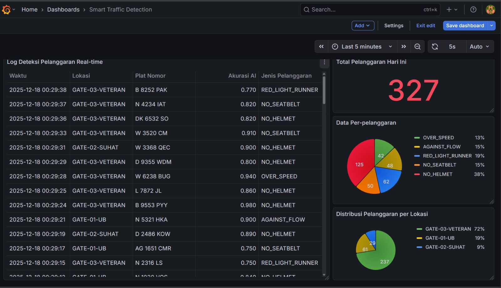

# 🚦 Smart Traffic Safety System (IoT Real-time Monitoring)


## 📋 Project Overview
**Smart Traffic Safety** adalah simulasi sistem IoT *End-to-End* untuk memantau berbagai jenis pelanggaran lalu lintas secara *real-time* di lingkungan Smart City.

Proyek ini mensimulasikan data dari kamera CCTV cerdas, dikirim via **Apache Kafka**, disimpan di **MySQL**, dan divisualisasikan di **Grafana**.

### 📸 Dashboard Preview


### 🚀 Key Features
* **Multi-Violation Detection:** Mendeteksi 5 jenis pelanggaran:
    * ❌ Tidak Pakai Helm (No Helmet)
    * 🚦 Terobos Lampu Merah (Red Light Runner)
    * 🏎️ Ngebut (Over Speed)
    * ⛔ Lawan Arus (Against Flow)
    * 🚗 Tidak Pakai Sabuk (No Seatbelt)
* **Weighted Logic Simulation:** Algoritma simulasi "cerdas" yang mengatur frekuensi pelanggaran sesuai realita (Contoh: Pelanggaran di Gerbang Veteran diset lebih sering terjadi dibanding lokasi lain).
* **Real-time Streaming:** Zero-delay data pipeline menggunakan Kafka.
* **Interactive Dashboard:** Grafik distribusi pelanggaran dan log data real-time.

## 🏗️ Architecture
**CCTV Simulator (Python)** --> **Apache Kafka** --> **Consumer Service** --> **MySQL Database** --> **Grafana Dashboard**

## 🛠️ Tech Stack
* **Language:** Python 3.10
* **Message Broker:** Apache Kafka & Zookeeper (CP-Kafka 7.6.0)
* **Database:** MySQL 8.0
* **Visualization:** Grafana
* **Infrastructure:** Docker & Docker Compose

## 📂 Database Schema
```sql
CREATE TABLE violations (
    id INT AUTO_INCREMENT PRIMARY KEY,
    timestamp DATETIME,
    location_id VARCHAR(50),
    violation_type VARCHAR(50), -- e.g., 'NO_HELMET', 'OVER_SPEED'
    confidence FLOAT,           -- AI Confidence Score (0.0 - 1.0)
    vehicle_plate VARCHAR(20),  -- e.g., 'N 1234 AB'
    status VARCHAR(20) DEFAULT 'Unverified'
);
